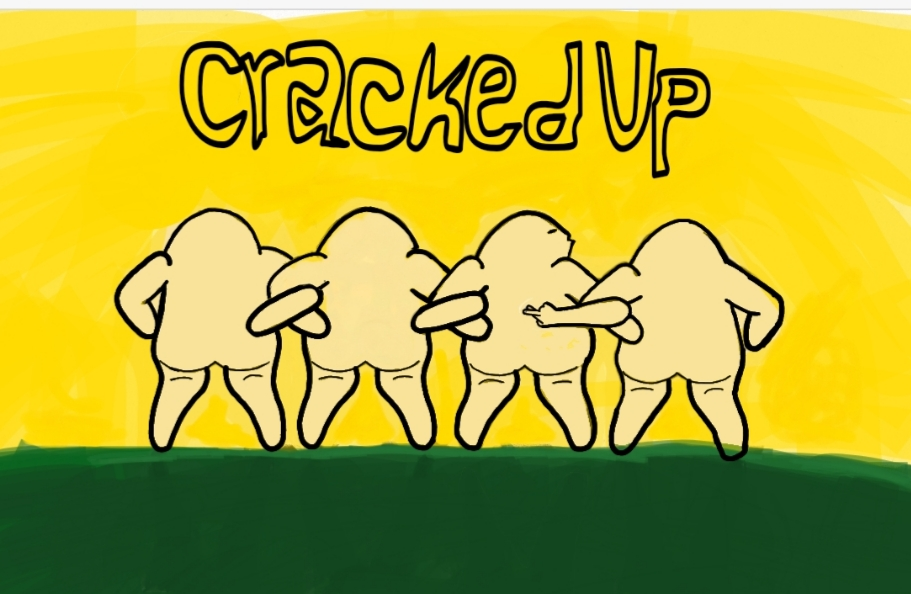
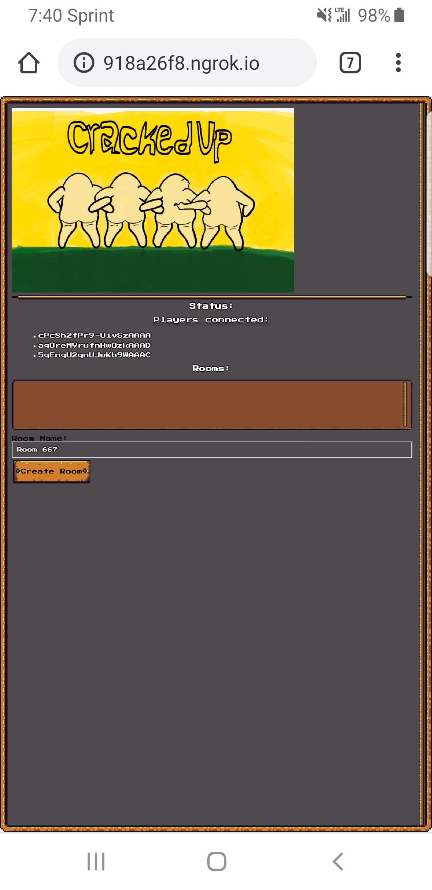
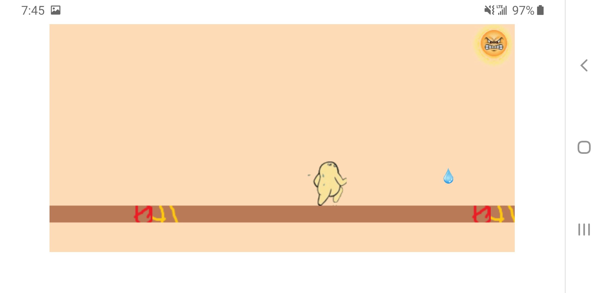

# Cracked Up
https://itch.io/jam/sd-gamejam-2019/rate/457453#post-834706

## How to install
1. Extract files, enter directory and open cmd/shell/bash at this location.
2. Execute `npm i` to install dependencies.
3. Execute `node server.js` to load the server.
4. Visit `http://localhost:3000/`

## built with:
visual studio
google chrome
socket.io
phaser3.js
jquery.js
express.js
node.js
npm
js.cookies.js
rpggui.css
ngrok.io

# Lobby System

# Mobile Client

